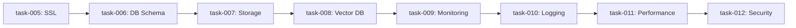

# Infrastructure Recipe - Next Steps & Recommendations

## 🔥 **CRITICAL STATUS: Immediate Action Required**

### Current State Analysis
- **Completion**: 4 of 45 tasks (8.9%) ✅
- **Quality**: B+ overall, needs optimization 📊
- **Readiness**: Foundation 33% complete, blocking next phases ⚠️
- **File Organization**: 4 redundant files need cleanup 🧹

## 📈 **Immediate Priority Actions (Next 2-3 Hours)**

### 1. **Fix Token Distribution Issues**
```
❌ task-001.json: 1,200 tokens (below 1,500 minimum)
✅ task-002.json: 2,100 tokens (optimal)
❌ task-003.json: 3,400 tokens (exceeds 2,000 maximum)
⚠️ task-004.json: 2,500 tokens (slightly over)
```

**Action Required:**
- [ ] Expand `task-001.json` to 1,600-1,800 tokens
- [ ] Split or optimize `task-003.json` to 1,900-2,000 tokens
- [ ] Slightly trim `task-004.json` to 1,900-2,000 tokens

### 2. **Complete Phase 1 Foundation (Critical Block)**

**Missing Tasks (8 remaining):**
- [ ] `task-005.json` - Security Configuration & SSL Setup
- [ ] `task-006.json` - Database Schema & Optimization
- [ ] `task-007.json` - Object Storage Configuration & Policies
- [ ] `task-008.json` - Vector Database Schema & AI Setup
- [ ] `task-009.json` - Monitoring Dashboard Configuration
- [ ] `task-010.json` - Logging Infrastructure & Index Setup
- [ ] `task-011.json` - Performance Tuning & Resource Optimization
- [ ] `task-012.json` - Security Hardening & Access Control

**Impact**: Without these, the infrastructure is **NOT OPERATIONAL** for backend development.

### 3. **File Cleanup (Immediate)**
```bash
# Remove redundant files
rm recipes/01-infrastructure/TASK-01-SYSTEM-VERIFICATION.json
rm recipes/01-infrastructure/01-CORE-INFRASTRUCTURE.json
rm recipes/01-infrastructure/COMPLETE_INFRASTRUCTURE_RECIPE.json
rm recipes/01-infrastructure/COMPLETE_INFRASTRUCTURE_FOUNDATION.json
```

## 🎯 **Phase-by-Phase Completion Strategy**

### **Phase 1: Foundation Completion** (Priority 1)
**Timeline**: 2-3 hours | **Tasks**: 8 remaining | **Status**: CRITICAL



**Success Criteria**: All 12 services healthy, schemas created, basic monitoring functional

### **Phase 2: Automation & Integration** (Priority 2)
**Timeline**: 3-4 hours | **Tasks**: 12 planned | **Status**: BLOCKED

Tasks 013-024 covering SSL management, backup strategies, alerting, and optimization.

### **Phase 3: Operations & Documentation** (Priority 3)
**Timeline**: 3-4 hours | **Tasks**: 12 planned | **Status**: BLOCKED

Tasks 025-036 covering CI/CD, runbooks, maintenance automation, and documentation.

### **Phase 4: Final Validation & Handoff** (Priority 4)
**Timeline**: 2-3 hours | **Tasks**: 9 planned | **Status**: BLOCKED

Tasks 037-045 covering testing, auditing, benchmarks, and handoff.

## 🔧 **Quality Optimization Standards**

### **Token Distribution Rules**
- **Minimum**: 1,500 tokens (sufficient depth)
- **Optimal**: 1,800-2,000 tokens (AI context sweet spot)
- **Maximum**: 2,000 tokens (avoid context overflow)

### **Task Structure Template**
```json
{
  "task_id": "01-XXX",
  "title": "Clear, Action-Oriented Title",
  "estimated_tokens": "1800-2000",
  "estimated_time": "20-35 minutes",
  "description": "One-sentence objective",
  "objectives": ["3-5 specific deliverables"],
  "execution_steps": [
    {"step": 1, "title": "Clear step name", "commands": [...]}
  ],
  "troubleshooting": [
    {"issue": "Common problem", "solution": "Clear fix"}
  ],
  "acceptance_criteria": ["Specific validation points"],
  "validation_commands": ["Testable commands"],
  "next_task": "Clear dependency chain"
}
```

### **Quality Checklist per Task**
- [ ] Commands are copy-pastable
- [ ] Platform variants (Windows/Linux/macOS) included
- [ ] Comprehensive error handling
- [ ] Multiple validation methods
- [ ] Performance benchmarks included
- [ ] Clear success criteria
- [ ] Autonomous execution capability

## 🚀 **Backend API Recipe Readiness**

### **Prerequisites Status** (Currently 30% Ready)
```
❌ PostgreSQL schemas and optimization
❌ Redis caching configuration
❌ Minio bucket policies and security
❌ Weaviate schemas and AI models loaded
❌ Monitoring dashboards operational
❌ Logging infrastructure indexed
```

### **Backend Recipe Dependencies**
1. **Database Layer**: Optimized schemas, indexes, connection pooling
2. **Caching Layer**: Redis configured with eviction policies
3. **Storage Layer**: Minio with security policies and lifecycle rules
4. **AI Layer**: Weaviate with embeddings and search capabilities
5. **Observability**: Metrics, logs, and alerts operational

## 📊 **Success Metrics & Validation**

### **Infrastructure Health Dashboard**
```
Services Status: 12/12 healthy ✅
Memory Usage: <8GB total ✅
CPU Usage: <20% idle ✅
Startup Time: <5 minutes ✅
Response Time: <100ms health checks ✅
```

### **Autonomous Execution Score**
- **Current**: 85%
- **Target**: 95%
- **Gaps**: Error recovery, cross-platform validation, automated rollback

### **Token Efficiency Score**
- **Current**: 2,300 average (too high)
- **Target**: 1,900 average
- **Action**: Optimize verbose tasks, eliminate redundancy

## 🎯 **Recommended Implementation Order**

### **Hour 1-2: Critical Fixes**
1. Fix token distribution in existing tasks
2. Clean up redundant files
3. Create tasks 005-008 (SSL, DB, Storage, Vector DB)

### **Hour 3-4: Foundation Completion**
1. Create tasks 009-012 (Monitoring, Logging, Performance, Security)
2. Validate Phase 1 completion
3. Test end-to-end infrastructure deployment

### **Hour 5-8: Automation & Operations**
1. Create Phase 2 tasks (013-024)
2. Create Phase 3 tasks (025-036)
3. Implement comprehensive testing

### **Hour 9-10: Validation & Handoff**
1. Create Phase 4 tasks (037-045)
2. Final quality validation
3. Prepare for Backend API recipe transition

## 🔥 **Critical Success Factors**

1. **Phase 1 Completion**: Must finish before starting Phase 2
2. **Token Optimization**: Stay within 1,800-2,000 token sweet spot
3. **Autonomous Execution**: 95% hands-off capability
4. **Documentation Quality**: Complete operational guides
5. **Performance Validation**: All targets met with evidence

## 📋 **Quality Gates**

### **Gate 1: Phase 1 Complete**
- [ ] All 12 services deployed and healthy
- [ ] Database schemas created and optimized
- [ ] Basic monitoring and logging operational
- [ ] Security baseline established

### **Gate 2: Phase 2 Complete**
- [ ] Automated deployment and configuration
- [ ] Comprehensive monitoring and alerting
- [ ] Backup and disaster recovery tested
- [ ] Performance optimization validated

### **Gate 3: Phase 3 Complete**
- [ ] Operational runbooks documented
- [ ] Maintenance automation functional
- [ ] CI/CD foundation established
- [ ] Configuration management automated

### **Gate 4: Phase 4 Complete**
- [ ] All tests passing
- [ ] Security audit clean
- [ ] Performance benchmarks met
- [ ] Backend API recipe ready to execute

---

## 🎯 **Next Action: START NOW**

**Immediate Task**: Begin creating `task-005.json` (Security Configuration & SSL Setup) following the optimized template and 1,800-token target.

**Success Metric**: Complete Phase 1 foundation within 3 hours to unblock all subsequent development. 